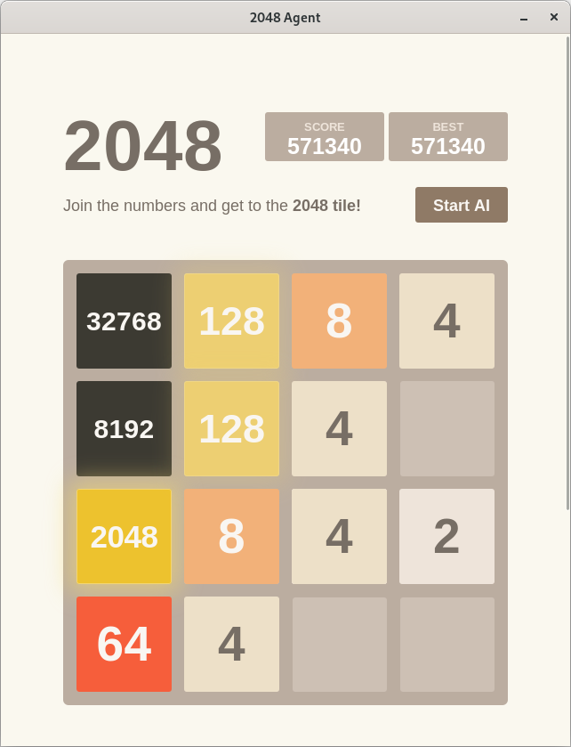

# 2048 Temporal Difference Learning

A 2048 agent with N-Tuple Network trained using Backward Temporal Coherence Learning.

## Benchmark (Intel® Core™ i5-8300H Processor)

### Score

1 ply search is the trained model without any tree search algorithm

3 ply is depth 2 expectimax search with the trained model for evaluation function

| Depth | Games | Scores | % 32768 | % 16384 | % 8192 |
| ----- | ----- | ------ | ------- | ------- | ------ |
| 1 ply | 10000 | 188596 | 3.48    | 35.35   | 69.61  |
| 3 ply | 300   | 420480 | 40      | 83      | 94     |

You can achieve similar results with:

```sh
# Build the program with the 4x6 tuple network
make STRUCTURE=nw4x6

# Train the network with 1000000 episodes, α = 1.0, λ = 0.5, TC and restart strategy
./2048 train -e 1000 -a 1.0 -l 0.5 -c -o -r

# Run the agent for 10000 games with no search
./2048 agent -e 10000

# Run the agent for 300 games with 3 ply search
./2048 agent -e 300 -d 2
```

### Tuple networks

| Structure | Size   | Max tile | Speed (1 thread) | Speed (8 threads) | Speed (3 ply, 8 threads) |
| --------- | ------ | -------- | ---------------- | ----------------- | ------------------------ |
| nw5x4     | 1.25MB |  8192    | 5901430 moves/s  | 20643753 moves/s  | 40542 moves/s            |
| nw4x5     | 16MB   | 16384    | 5560291 moves/s  | 18563599 moves/s  | 50428 moves/s            |
| nw6x5     | 24MB   | 16384    | 3905823 moves/s  | 12509119 moves/s  | 37908 moves/s            |
| nw4x6     | 256MB  | 32768    | 2553369 moves/s  |  8381214 moves/s  | 40051 moves/s            |
| nw8x6     | 512MB  | 32768    | 1525958 moves/s  |  4279976 moves/s  | 19764 moves/s            |

## Features

- Backward TD(λ) learning.
- N-Tuple Network with configurable structure.
- Optional temporal coherence learning and restart strategy.
- Expectimax search with configurable depth.
- [Webview](https://github.com/webview/webview) based GUI application.
- Multi-threaded training and evaluation.

To achieve high speed and fast learning, both the agent and training code are heavily optimized:

- 64-bit bitboard representation.
- Table lookup for movement and reward.
- Transposistion table with Zobrist Hash.
- Bit optimizations.
- Efficient N-Tuple Network implementation with static structure.

## Usage

Download and unzip the trained model (8x6tuple network) [here](../../releases/latest).

### Build

GCC and GNU Make are required to build the program.
Currently, the makefile only supports Linux. Building the program on other platforms should be possible, but not tested.
Cross platform build script is planned.

To build the GUI, you need to install the GTK+ development libraries and webkit2gtk-4.0 and enable the submodule.

Building the program on Google Colaboratory is also supported if you disable the GUI.

#### Build steps

```sh
make [Options]
```

Parameters:

- **STRUCTURE**: The tuple network structure. (default: nw4x6)
- **ENABLE_GUI**: Enable the GUI. (default: true)
- **EXTRAS**: Extra compiler options for profiling, etc.

Available structures: (See [benchmark](#tuple-networks))

### Train model

```sh
./2048 train [Options]
```

Parameters:

```
-a <alpha>    -- Set the learning rate
                 default: 0.1
-l <lambda>   -- Set the trace decay
                 default: 0.5
-e <episodes> -- Set the number of training games * 1000
                 default: 1
-t <threads>  -- Set the number of threads
                 default: 1 (0 uses all threads)
-i            -- Enable reading from a binary file
-o            -- Enable writing to a binary file
-c            -- Enable temporal coherence learning
-r            -- Enable restart strategy
-h            -- Show this message
```

### Run agent

```sh
./2048 agent [Options]
```

Parameters:

```
-d <depth>    -- Set the search depth
                 default: 0
-e <episodes> -- Set the number of games to play
                 default: 1
-t <threads>  -- Set the number of threads
                 default: 1 (0 uses all threads)
-g            -- Enable the GUI
-h            -- Show this message                        
```

Example:

```sh
./agent -d2 -i100 -t 0 # 3 ply, 100 games, multi-threaded
./agent -d4 -g         # 5 ply, enable GUI
```

Example game with the GUI:



## Todo

- [ ] Add multi-stage learning
- [ ] Add more settings to the GUI application

# License

This app is licensed under the MIT license.
